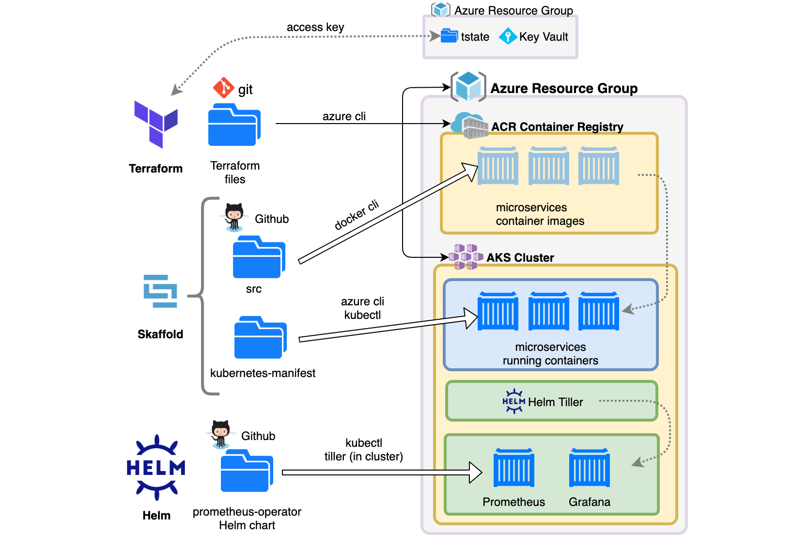

[<< Back to index](../){:class="solid-btn text-center"}

# Kubernetes tutorial

## 0. Getting started

### Introduction

Hipster Shop is a demo project to test a microservices architecture on Kubernetes. It comprises an online shop powered by 10 different microservices, written in different programming languages (Java, Go, C#, Python, JavaScript/NodeJS). It is not a functional service or optimized, and its purpose is only for learning and testing. It comes with Locust preconfigured, a load generator that will start to run simulated traffic on the shop as soon as it boots up. 

The original Hipster Shop demo is intended for use in a local Kubernetes cluster or deployed to Google Kubernetes Engine. As Kubernetes is a standard, to add value to this demo we will explain how to deploy it on Azure Kubernetes Services (AKS) using Terraform, with a special focus on specific requirements for this cloud provider.

We will also deploy Prometheus as a metric extractor and Grafana as a visualization tool for those metrics into the Kubernetes cluster using Helm.

{:class="img-fluid"}

### How to use

These instructions come with some __optional__, __alternative__ and __improvement__ parts. You can skip them if you like for a straight forward procedure. The improvements will suggest additional task that you could investigate on your own to improve this exercise.

We will assume we use a __bash__ shell environment. Whenever an example script starts with $, it means you should type what is beyond the symbol in your terminal. Sometimes the expected output of a command is shown, to make it easier to identify output information.

If you are using Windows, most of the explanations here could be used in cmd.exe, but you can achieve full compatibility by using [Windows Subsystem for Linux](https://docs.microsoft.com/en-us/windows/wsl/install-win10).

*Improvement:* Adapt the explanations and scripts to be able to use them from Windows's cmd.exe or Powershell.

---
[Next step: 1. Prerequisites >>](./01_prerequisites.md){:class="solid-btn text-center"}  
