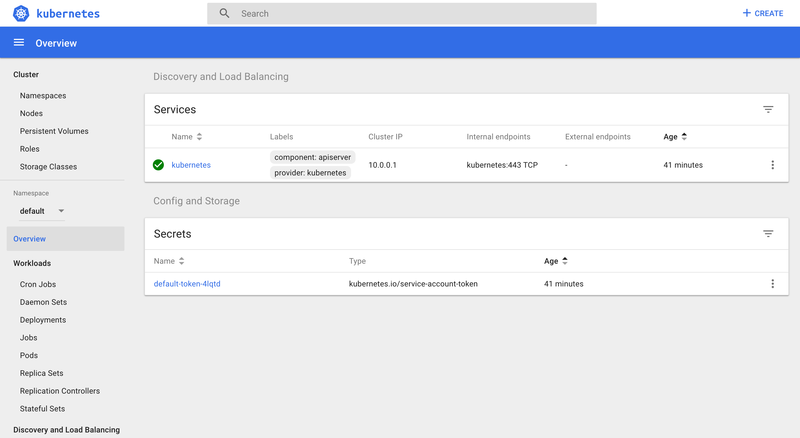

# Azure Hipster Shop: AKS Microservices Demo

## 4. Get Kubectl and ACR credentials

### Get Kubectl credentials

To store credentials needed to Kubectl to log into your cluster, use:
```
$ az aks get-credentials --resource-group SysTest-k8s-resources --name SysTest-k8s --overwrite
```

### Optional: Examine Kubernetes cluster

#### Kubectl context

To check which context you are connected to with kubectl:

```
kubectl config current-context
```

If you what to list all other contexts:

```
kubectl context view
```

#### AKS deployment of Dashboard

You can deploy a web dashboard to inspect all the parameters of your cluster using:

```
az aks browse --resource-group SysTest-k8s-resources --name SysTest-k8s
```

A new browser window will open to the dashboard at http://127.0.0.1:8001 without having to enter additional credentials. [More info at this link](https://docs.microsoft.com/en-us/azure/aks/kubernetes-dashboard).



_Alternative_: To do the same for any Kubernetes cluster, use:

```
kubectl apply -f https://raw.githubusercontent.com/kubernetes/dashboard/v2.0.0-beta4/aio/deploy/recommended.yaml
kubectl proxy
```

And open the url: http://localhost:8001/api/v1/namespaces/kubernetes-dashboard/services/https:kubernetes-dashboard:/proxy/.
You will be asked for your credentials or kubeconfig configuration to log in.


See: https://kubernetes.io/docs/tasks/access-application-cluster/web-ui-dashboard/

### Login with Docker to Azure Container Registry

We need to log in with the Docker client to our Azure Container Registry we created previously, so Skaffold can use it to push images to it.

To do so, use the following command from the `infra` folder that retrieves the necessary variables from the Terraform state.

```
$ docker login $(terraform output acr_uri) -u $(terraform output acr_user) -p $(terraform output acr_password)

WARNING! Using --password via the CLI is insecure. Use --password-stdin.
WARNING! Your password will be stored unencrypted in /home/mord/.docker/config.json.
Configure a credential helper to remove this warning. See
https://docs.docker.com/engine/reference/commandline/login/#credentials-store

Login Succeeded
```

We will also store the ACR URI, so it is easier to reference outside terraform infrastructure directory:
```
$ ACR_URI="$(terraform output acr_uri)" && echo $ACR_URI
```

We will also store it in a environment variable name that Skaffold will recognize for it to use a different container registry that Docker Hub on each command execution:

```
$ set SKAFFOLD_DEFAULT_REPO=ACR_URI
```

_Improvement_: Set up cluster's RBAC to use Azure Active Directory role mapping.

---
[Next step: 5. Create cluster with Skaffold](../docs/05_cluster_skaffold.md)  

[Previous step: 3. Provision infrastructure with Terraform](../docs/03_infra_terraform.md)

